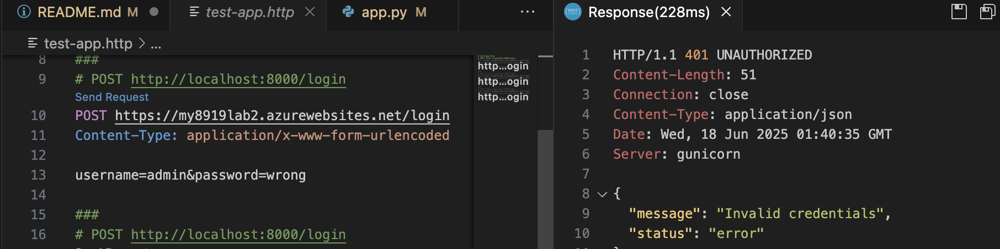

## 🎥 Video Demonstration

[](https://www.youtube.com/watch?v=S-MBQgTe8c8)

Click the image above or [watch the demo on YouTube](https://www.youtube.com/watch?v=S-MBQgTe8c8).

## command List
1. Creat resourse group
az group create --name 8919lab2 --location canadacentral

2. Creat App Servide
az appservice plan create --name 8919lab2Plan --resource-group 8919lab2 --sku FREE --location canadacentral --is-linuxaz 


3. Creat Web App
az webapp create --resource-group 8919lab2 --plan 8919lab2Plan --name my8919lab2 --runtime "PYTHON|3.9" --deployment-local-git


4. config Git remote
git remote add azure https://shaoxian8919lab2@my8919lab2.scm.azurewebsites.net/my8919lab2.git

5. Deploy to Azure
git add .
git commit -m "Deploy Flask app with Python 3.9"
git push azure main

6. Test Deploy



# CST8919 Lab 2: Building a Web App with Threat Detection using Azure Monitor and KQL

## Objective
This lab aimed to create a simple Python Flask application, deploy it to Azure App Service, enable diagnostic logging with Azure Monitor, use Kusto Query Language (KQL) to analyze logs, and configure an alert rule to detect suspicious activity (brute-force login attempts) and send email notifications.

## Project Overview
The Flask application includes a `/login` route that logs successful and failed login attempts. The app is deployed to Azure, monitored using a Log Analytics workspace, and secured with an alert system to detect excessive failed login attempts.

## What I Learned
During this lab, I gained hands-on experience with:
- Developing a Flask application and integrating logging functionality.
- Deploying a web app to Azure App Service using Git.
- Configuring Azure Monitor and Log Analytics to collect and analyze application logs.
- Writing KQL queries to filter and summarize log data.
- Setting up alert rules and Action Groups for automated notifications.

I also learned the importance of troubleshooting deployment issues (e.g., 404 errors) and adjusting configurations (e.g., Gunicorn startup commands) to match Azure's environment.

## Challenges Faced
1. **URL Confusion**: Initially, I mistakenly accessed the `.scm` endpoint (`my8919lab2.scm.azurewebsites.net`) instead of the app URL (`my8919lab2.azurewebsites.net`), leading to "No route registered" errors.
2. **404 Errors**: The application returned 404 until I added a root route (`/`) and ensured the Gunicorn startup command was correctly configured.
3. **KQL Query Matching**: Finding the correct column name (`ResultDescription`) in Log Analytics and adjusting the `contains` condition to match "Login failed" was challenging due to initial mismatches with "Failed login".
4. **Email Alert Issues**: The Action Group test email failed, requiring troubleshooting of configuration and potential delays.

## How to Improve Detection Logic in a Real-World Scenario
- **IP Address Tracking**: Add IP address logging to identify the source of brute-force attacks.
- **Rate Limiting**: Implement rate limiting in the Flask app to reduce the impact of attacks.
- **Advanced KQL Queries**: Use additional filters (e.g., IP, user agent) and correlation with other logs for more precise detection.
- **Multi-Channel Alerts**: Integrate SMS or SMS notifications alongside email for critical alerts.
- **Anomaly Detection**: Employ machine learning models in Azure to detect unusual login patterns.

## KQL Query with Explanation
```kql
AppServiceConsoleLogs
| where ResultDescription contains "Login failed"
| summarize FailedLogins = count() by bin(TimeGenerated, 5m)
| where FailedLogins > 5